# Demo 1.3 — Documentación de scripts

Este README describe los scripts incluidos en `Assets/Miprimerpersonaje/FinalCharacterController`.

Incluye:

- Resumen de cada archivo .cs
- Lista de clases, variables y métodos principales
- Diagramas UML (PlantUML) por clase para visualizar relaciones y llamadas

Nota: Los diagramas están en formato PlantUML dentro de bloques de código ```plantuml``` para que puedas copiarlos a un archivo .puml y renderizarlos con PlantUML.

## Contrato breve (inputs/outputs/errores)

- Input: Componentes Unity (CharacterController, Animator, Camera, Input System)
- Output: Estados y comportamientos del personaje (movimiento, animación, input)
- Modo de error: si `PlayerInputManager.Instance` no está inicializado los componentes de input muestran errores en consola y no se habilitan los mapas.

## Scripts principales

### PlayerState (Assets/Miprimerpersonaje/FinalCharacterController/Scripts/PlayerState.cs)

- Propósito: Mantener el estado de movimiento del jugador (Idling, Walking, Running, ...)
- Clases/Tipos: `PlayerState` (MonoBehaviour), `PlayerMovementState` (enum)
- Miembros relevantes:
  - field: `PlayerMovementState CurrentPlayerMovementState { get; private set; }`
  - `SetPlayerMovementState(PlayerMovementState)`
  - `InGroundedState(): bool` — true si el estado actual es tierra (Idle/Walking/Running/Sprinting)
  - `IsStateGroundedState(PlayerMovementState): bool`

PlantUML:

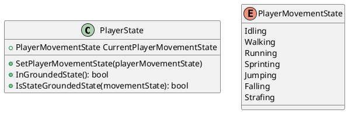

### PlayerController (Assets/Miprimerpersonaje/FinalCharacterController/Scripts/PlayerController.cs)

- Propósito: Lógica principal de movimiento, físicas verticales, lateral movement, rotación y control de cámara.
- Clases: `PlayerController` (MonoBehaviour)
- Dependencias: `PlayerLocomotionInput`, `PlayerState`, `CharacterController`, `Camera`, `CharacterControllerUtils`
- Campos más importantes (resumen):
  - Componentes: `_characterController`, `_playerCamera`
  - Movimiento: `walkSpeed`, `runSpeed`, `sprintSpeed`, `walkAcceleration`, `runAcceleration`, `sprintAcceleration`...
  - Física: `gravity`, `terminalVelocity`, `jumpSpeed`
  - Cámara/Rotación: `lookSenseH`, `lookSenseV`, `playerModelRotationSpeed`, `rotateToTargetTime`
- Métodos principales:
  - `Awake()` — obtención de componentes
  - `Update()` — llama a `UpdateMovementState()`, `HandleVerticalMovement()`, `HandleLateralMovement()`
  - `UpdateMovementState()` — establece `PlayerState` según input y grounded
  - `HandleVerticalMovement()` — aplica gravedad y salto
  - `HandleLateralMovement()` — aplica aceleración, arrastre, y mueve con `CharacterController.Move`
  - `HandleSteepWalls(Vector3)` — corrige la velocidad al chocar con pendientes
  - `LateUpdate()`/`UpdateCameraRotation()` — control de cámara y rotación del personaje
  - Checks: `IsMovingLaterally()`, `IsGrounded()`, `IsGroundedWhileGrounded()`, `IsGroundedWhileAirborne()`, `CanRun()`

PlantUML (resumen de relaciones):

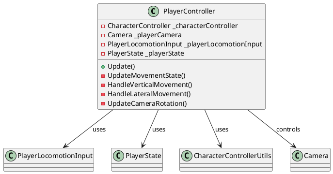

### PlayerAnimation (Assets/Miprimerpersonaje/FinalCharacterController/Scripts/PlayerAnimation.cs)

 - Propósito: Actualizar parámetros del `Animator` basándose en input y `PlayerState`.
 - Clases: `PlayerAnimation`
 - Dependencias: `Animator`, `PlayerLocomotionInput`, `PlayerState`, `PlayerController`, `PlayerActionsInput`
 - Miembros: hashes de animator (`inputX`, `inputY`, `isGrounded`, `isJumping`, `isFalling`, `isRotatingToTarget`, `rotationMismatch`, `isAttacking`, `isGathering`, `isPlayingAction`), blend smoothing, `actionHashes` array.
 - Métodos principales: `Awake()` para referencias, `Update()` -> `UpdateAnimationState()` que setea booleans y floats del animator.

PlantUML:

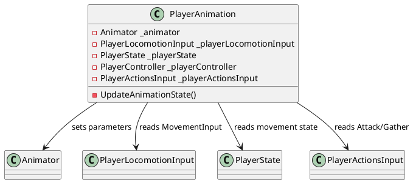

### CharacterControllerUtils (Assets/Miprimerpersonaje/FinalCharacterController/Scripts/CharacterControllerUtils.cs)

 - Propósito: Funciones utilitarias para `CharacterController`. Actualmente dispone de:
   - `GetNormalWithSphereCast(CharacterController, LayerMask)` — devuelve normal del suelo usando SphereCast

PlantUML:

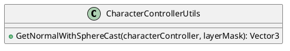

### Input & manager scripts

 - `Assets/Miprimerpersonaje/FinalCharacterController/Scripts/Input/ThirdPersonInput.cs`
   - Implementa `PlayerControls.IThirdPersonMapActions`
   - Controla zoom de cámara (`ScrollInput`) y engancha los callbacks del `PlayerInputManager.Instance`.

PlantUML:

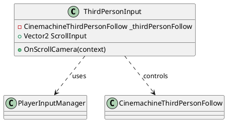

 - `Assets/Miprimerpersonaje/FinalCharacterController/Scripts/Input/PlayerLocomotionInput.cs`
   - Implementa `PlayerControls.IPlayerLocomotionMapActions`
   - Proporciona propiedades: `MovementInput`, `LookInput`, `JumpPressed`, `SprintToggledOn`, `WalkToggledOn`
   - Maneja callbacks OnMovement, OnLook, OnToggleSprint, OnJump, OnToggleWalk

PlantUML:

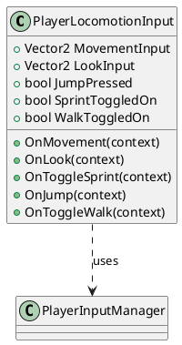

 - `Assets/Miprimerpersonaje/FinalCharacterController/Scripts/Input/PlayerInputManager.cs`
   - Singleton (`Instance`) que inicializa `PlayerControls` y habilita los mapas.
   - Expone `PlayersControls` (instancia generada de `PlayerControls`)

PlantUML:

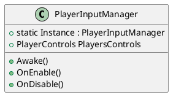

 - `Assets/Miprimerpersonaje/FinalCharacterController/Scripts/Input/PlayerActionsInput.cs`
   - Implementa `PlayerControls.IPlayerActionMapActions`
   - Propiedades: `AttackPressed`, `GatherPressed`
   - Reset de inputs de acción si el jugador se mueve o está en aire

PlantUML:

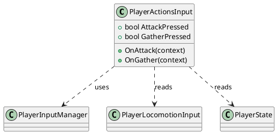

### PlayerControls (Assets/Miprimerpersonaje/FinalCharacterController/Input/PlayerControls.cs) (autogenerado)

  - Propósito: Código generado por el Unity Input System que contiene `InputActionMaps` y wrappers (PlayerLocomotionMap, ThirdPersonMap, PlayerActionMap).
  - Contenido: varias estructuras internas (PlayerLocomotionMapActions, ThirdPersonMapActions, PlayerActionMapActions) con métodos `Enable()`, `Disable()`, `AddCallbacks()` y `SetCallbacks()` y la implementación de interfaces `IPlayerLocomotionMapActions`, `IThirdPersonMapActions`, `IPlayerActionMapActions`.

PlantUML (simplificado):

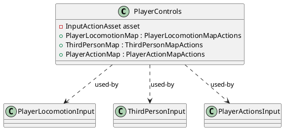

## Relaciones generales

- `PlayerInputManager` crea y expone `PlayerControls`.
- Los componentes `PlayerLocomotionInput`, `ThirdPersonInput`, `PlayerActionsInput` se registran como callbacks contra `PlayerControls` a través de `PlayerInputManager.Instance`.
- `PlayerController`, `PlayerAnimation` y `PlayerActionsInput` leen el estado en `PlayerState` y usan `PlayerLocomotionInput` para obtener input del jugador.


## Diagrama UML global (todas las clases y relaciones)

El siguiente diagrama muestra todas las clases analizadas, sus variables y métodos principales, y las relaciones entre ellas. Puedes copiar este bloque a un archivo `Docs/diagrams/global_class_diagram.puml` y renderizarlo con PlantUML.

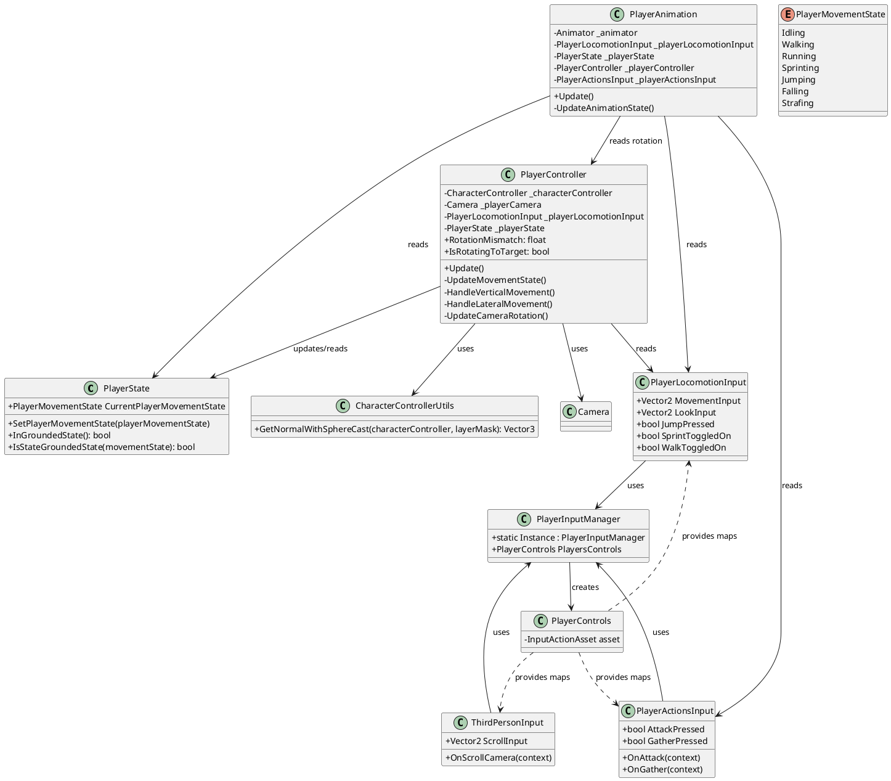

## Mapa mental / mapa de archivos

Abajo hay un mapa mental simplificado (PlantUML mindmap) que representa la estructura de archivos y cómo los scripts están organizados dentro de `Assets/Miprimerpersonaje/FinalCharacterController`.

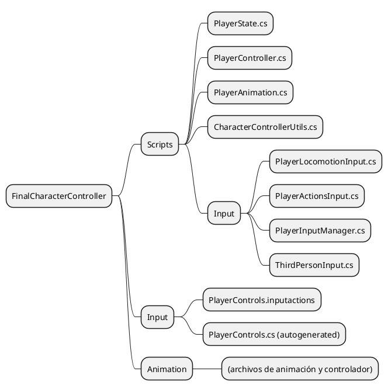

---

Con esto el `README.md` incluye:
- Diagramas PlantUML por clase (anteriores)
- Un diagrama UML global con todas las clases + relaciones
- Un mapa mental de la estructura de archivos

Si quieres, puedo ahora:
- Guardar cada bloque PlantUML en `Docs/diagrams/` como `.puml` (recomendado). 
- Generar PNG/SVG desde esos `.puml` (requiere Java + plantuml.jar o la extensión PlantUML). Indícame si quieres que lo ejecute.

